## Part 1 - Getting Setup with Oracle Free Tier for Education

Students in this course will be using Oracle Cloud Free Tier Account for Education. This cloud service provides Free Oracle Autonomous Database instances that will be used in class. Additionally, once registered you get 365 days and $300 free money to use on Paid Cloud Services that will also be used in class. Please note that this Free Tier is different from the Normal Oracle Free Tier in that you are not required to provide a credit card and you have 365 days instead of 30 days of use for non-free services.

If you already have a registered Oracle Free Tier for Education account and you have more than 30 days left on the account you can proceed to Part 2.

[Part 2: Autonomous Database Startup Guide](/Oracle-Cloud-Free-Tier-Education-Setup/?lab=part-2-autonomous-database-startup-guide)

## Setup Oracle Free Tier for Education

In order to get the Oracle Cloud Free Tier with 365 days of $300 you will get an email from Oracle Academy asking you to register.

The email will come from Oracle Academy or no_reply@oracle.com. The email will indicate that your instructor has requested your account and will look something like the one instructors get, shown in Figure 1.

<figure>
    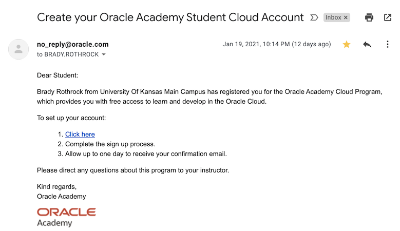
    <figcaption style="text-align:center;">Figure 1<figcaption>
</figure>

This email has the link the you need to follow to register for the account. Before clicking on the link and registering you need to determine the email address that is linked to the Education Program. It is the only one that gives you 365 days to use the Free $300 credits.

Since KU email accounts can have several aliases you need to determine which email was given to Oracle. Go to the email and click on, or right click on, the actual email address that Oracle used. As you can see in Figure 2 the email used is shown and circled. Check your email find the email and get the email used. *Make note of this email. You will need it for the next steps.*

<figure>
    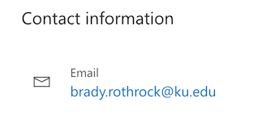
    <figcaption style="text-align:center;">Figure 2<figcaption>
</figure>

Once you have the email address click on the “Click Here” link on the email. You will now go to the Cloud Sign-up Page (Figure 3)

<figure>
    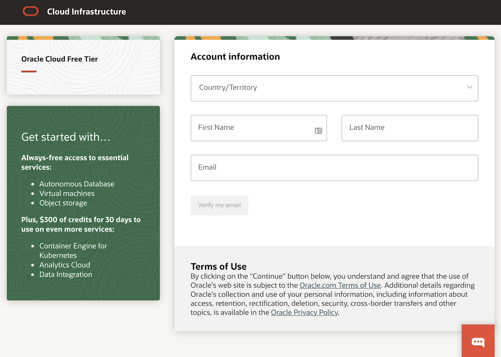
    <figcaption style="text-align:center;">Figure 3<figcaption>
</figure>

Enter the email address that Oracle Academy used to send you the email. *Do not use any other email address or you will be signing up for a 30 day account instead of the 365 day education account.*

Click Next to continue with the registration.

You should now see this next screen in Figure 4. This is notification that you are eligible for the Special 365 day Program.

<figure>
    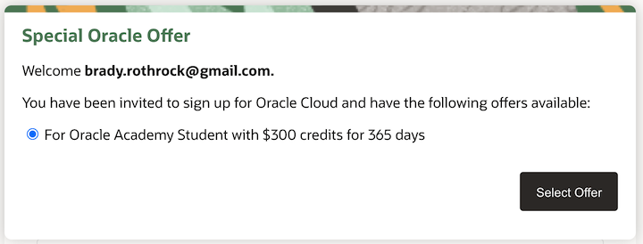
    <figcaption style="text-align:center;">Figure 4<figcaption>
</figure>

**If you do not see this screen STOP! Verify your Email Address again and try again. Do not continue if you don't see this dialog box. Contact your instructor if you cannot fix this.**

**Do not give Oracle a credit card number, as it is not required for the Student account.**

Click the **Select Offer** button to continue.

You will be asked for a **Password**, **Account Name** (this is not your email address), and **Home Region**. 

Enter a valid password follwoing the requirements and keep this handy.

You can skip **Company Name** as it is optional.

Enter an **Account Name** that is unique to you. A recommendaation is to use your first initial and last name or your fullname.

*Remember this as you will always need it to sign in.*

Next you will be asked to choose a **Home Region**. Ashburn or Phoenix are the proper options.

<figure>
    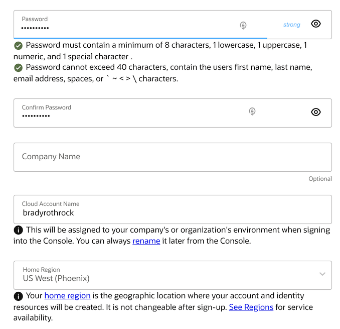
    <figcaption style="text-align:center;">Figure 5<figcaption>
</figure>

Now click **Continue** to proceed.

You will be asked now to provide your address and phone information as shown in Figures 6 & 7. 

Check the box to accept the free trial agreement and click **Start my free trial**.

<figure>
    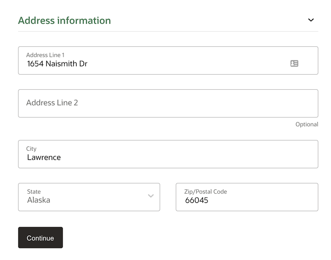
    <figcaption style="text-align:center;">Figure 6<figcaption>
</figure>

<figure>
    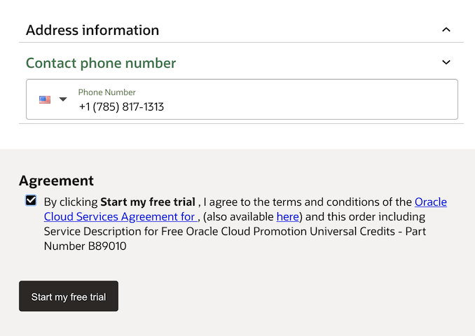
    <figcaption style="text-align:center;">Figure 7<figcaption>
</figure>

Now your account will be provisioned. When the process is finished it will eventually bring up the Login Screen (Figure 9). If you receive an error instead of the Login Screen check your email for a confirmation message from **Oracle Cloud** with a link to **Sign In to Oracle Cloud** (Figure 8).

<figure>
    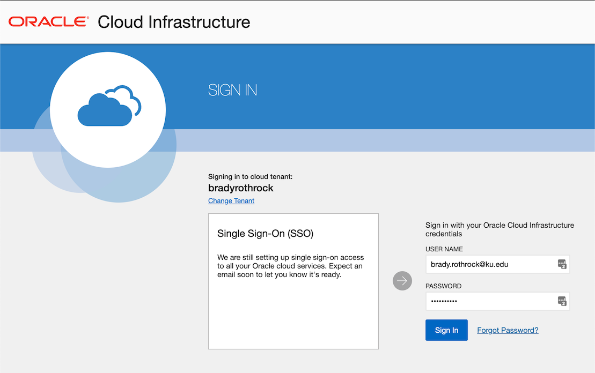
    <figcaption style="text-align:center;">Figure 8<figcaption>
</figure>

<figure>
    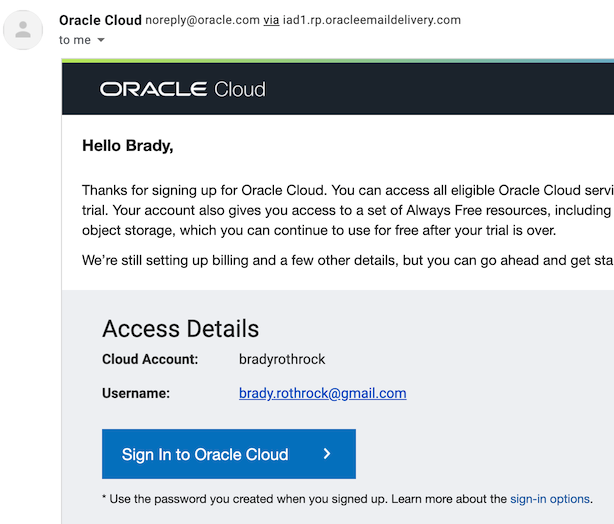
    <figcaption style="text-align:center;">Figure 9<figcaption>
</figure>

Remember to write down the account name and username (your email address used to register) and password.

You need to enter your username and password to log you in to the Oracle Cloud home page.

It will take a while to provision, potentially as much as an hour or so, to complete and you will see that you have a Trial Balance of $300 that is good for 365 days. 

<figure>
    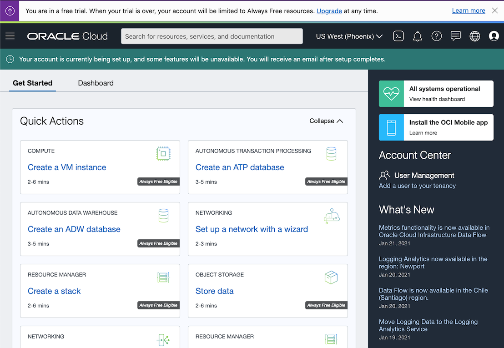
    <figcaption style="text-align:center;">Figure 10<figcaption>
</figure>

Sign out of your account now and wait for at least 1 hour. 

Sign back in using the following login method:
- Go to oracle.com URL
- Click on Menu Item > View Accounts

Click on Sign-in to Cloud (Figure 11).

At this point consider bookmarking this screen (Oracle Cloud Sign-on).

<figure>
    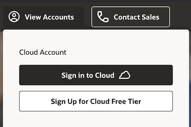
    <figcaption style="text-align:center;">Figure 11<figcaption>
</figure>

Enter your Account Name (Figure 12).

If you forgot your Account Name it's in your registration email as **Cloud Account**.

<figure>
    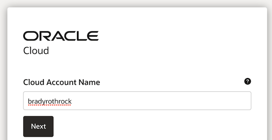
    <figcaption style="text-align:center;">Figure 12<figcaption>
</figure>

Click Next.

Now enter in your email address and password used to create the account (Figure 13).

<figure>
    
    <figcaption style="text-align:center;">Figure 13<figcaption>
</figure>

You should now see the Your Oracle Cloud Main Home Page

<figure>
    
    <figcaption style="text-align:center;">Figure 14<figcaption>
</figure>

You are done!

Notice you should have money available in your trial credits and Trial Days should be more than 30.

<figure>
    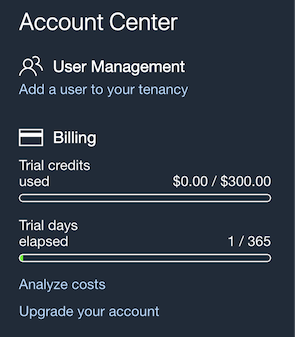
    <figcaption style="text-align:center;">Figure 15<figcaption>
</figure>

Note: If you happen to see that you only have 30 days of Trial then you did not actually create the account using the proper education email address. Contact your Instructor Immediately. 

You will need to create a new cloud account using the email account that Oracle Academy contacted you with.

*Hint: You can bookmark this page and it will go directly to the prompt without having to go to oracle.com again.*

[Part 2: Autonomous Database Startup Guide](/Oracle-Cloud-Free-Tier-Education-Setup/?lab=part-2-autonomous-database-startup-guide)