## Part 2 - Autonomous Database Startup Guide

## Creating Autonomous Database

1. Sign into your Cloud account and you will be presented with your dashboard. Select Autonomous Transaction Processing, Create an Autonomous Data Warehouse database.

<figure>
    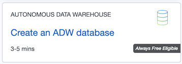
    <figcaption style="text-align:center;">Figure 1<figcaption>
</figure>

2. Enter a Display name as well as a Database name. Add a password to the Administrator Credentials section. Move the Always Free selector to the right.

- Display Name: A user-friendly description or other information that helps you easily identify the resource. The display name does not have to be unique, and you can change it whenever you like. Avoid entering confidential information. Recommend using ADW+your initials + 01

- Database Name: The database name must consist of letters and numbers only, starting with a letter. The maximum length is 14 characters. Avoid entering confidential information. You can use the same as Displayname without Spaces! *I suggest that you give your database name that is easy to remember. I use something like BRADW01 where “BR” are my initials.*

<figure>
    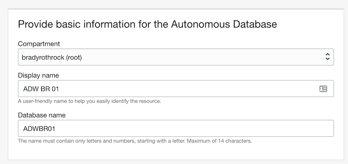
    <figcaption style="text-align:center;">Figure 2<figcaption>
</figure>

3. Verify the defaults for the remaining fields below.

- Workload Type: Data Warehousing

- Deployment Type: Shared Infrastructure.

- Always Free: Move this selector to the right so that the provisioning workflow shows only the Always Free
configuration options. Note that the Core CPU count and Storage configuration fields are disabled when provisioning an Always Free Autonomous Database. Your database will have 1 OCPU, 8 GB of memory, and 20 GB of storage.

*Note: if failing to select Always Free your credits will be charged*

<figure>
    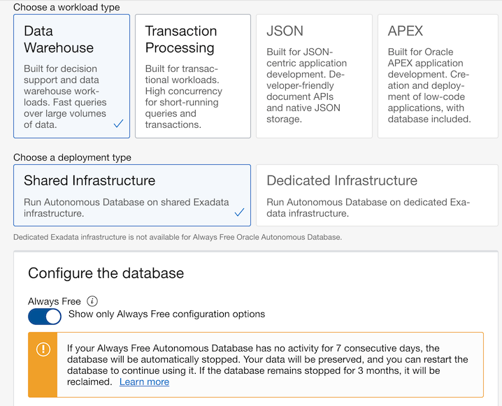
    <figcaption style="text-align:center;">Figure 3<figcaption>
</figure>

- Administrator Credentials: Set the password for the Autonomous Database Admin user by entering a
password that meets The USERNAME is always ADMIN – Remember this! the following criteria:
  
    1. Between 12 and 30 characters long
    2. Contains at least one lowercase letter
    3. Contains at least one uppercase letter
    4. Contains at least one number
    5. Does not contain the double quotation mark (")
    6. Does not contain the string "admin", regardless of casing

Use this password when accessing the Autonomous Database service console and when using an SQL client tool. WRITE THIS DOWN ALONG WITH THE USER NAME --- YOU WILL USE THIS A LOT!!!

<figure>
    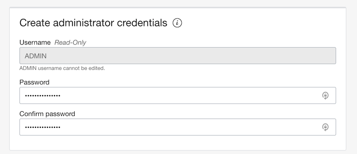
    <figcaption style="text-align:center;">Figure 4<figcaption>
</figure>

- License Type: When you provision an Always Free Autonomous Database, the license type is set to License included and cannot be adjusted.

- Advanced Options

Tags: Optionally, you can apply tags. If you have permissions to create a resource, you also have permissions to apply free- form tags to that resource. To apply a defined tag, you must have permissions to use the tag namespace. For more information about tagging, see Resource Tags. If you are not sure if you should apply tags, skip this option (you can apply tags later) or ask your administrator. Avoid entering confidential information.

4. Click **Create Autonomous Data Warehous Database**.

<figure>
    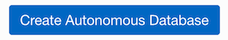
    <figcaption style="text-align:center;">Figure 5<figcaption>
</figure>

5. It may take several minutes for your database to be provisioned, while this is happening you will see this screen :

<figure>
    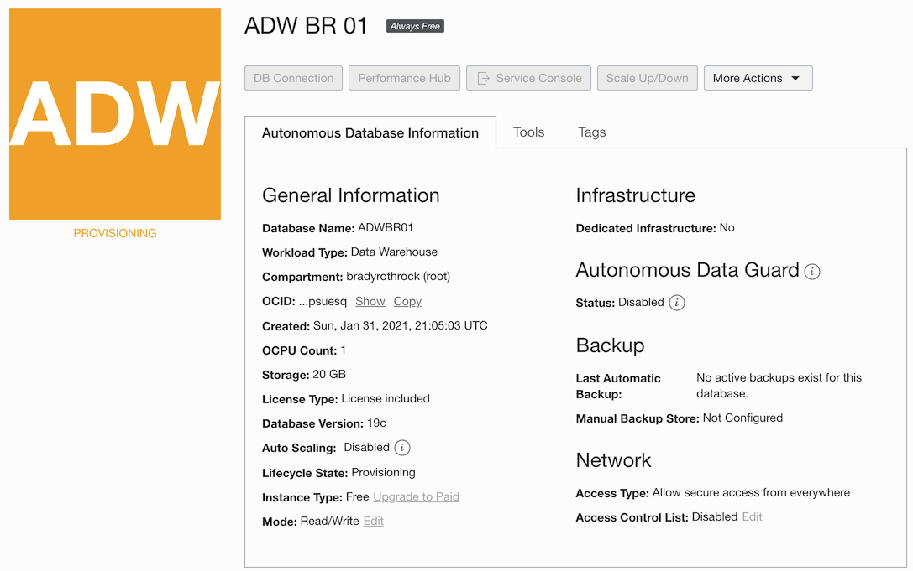
    <figcaption style="text-align:center;">Figure 6<figcaption>
</figure>

6. When this process is completed, you will now see the state set to available. This means that your database instance is created.

<figure>
    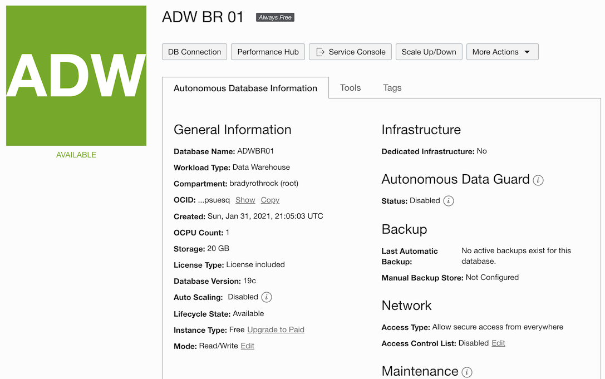
    <figcaption style="text-align:center;">Figure 7<figcaption>
</figure>

7. Now that the database is running you should create the Wallet file which you will need to login using SQLDeveloper Desktop and Oracle Analytics (Cloud and Desktop)

8. You now have a live database server!
At any point you can sign in to your Cloud account and return to your database by using the hamburger icon in the top left corner and selecting Autonomous Data Warehouse.

<figure>
    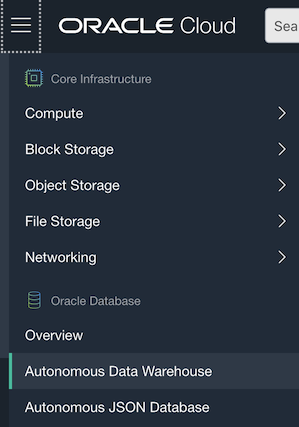
    <figcaption style="text-align:center;">Figure 8<figcaption>
</figure>

10. This will return you to your database page where you can select your live database.

<figure>
    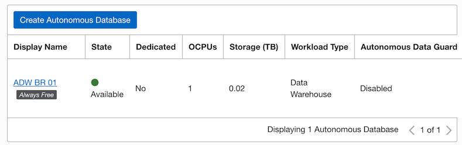
    <figcaption style="text-align:center;">Figure 9<figcaption>
</figure>

11. If you save a shortcut to go directly to this Cloud Database Page you will go through the typical Cloud Login process and then land on the Cloud Database Page listing your configured Database Instances.

- When a database is open you can click on various things like **More Actions** to Start/Stop/Terminate, change Admin Password or use Apex. If you click on the **Tools** tab you'll find **SQL Developer Web**. You can also click on the DB Connection button to create wallet file to connect to ADW using SQLNet or other tools, like SQLDeveloper Desktop or Oracle Analytics Desktop which we will do later in the course.

## Restarting your Autonomous Database if it has stopped due to inactivity:

- If your Always Free Autonomous Database has no activity for a period of 7 consecutive days, the Database service will stop the database automatically. You will also get an email from Oracle when they automatically turn off your Database.

<figure>
    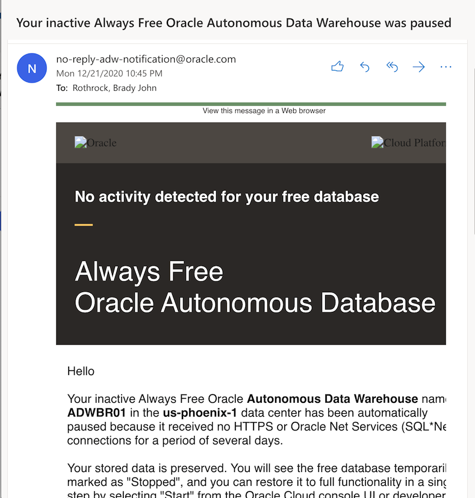
    <figcaption style="text-align:center;">Figure 10<figcaption>
</figure>

- If this happens, you are allowed to restart the database and continue using it. If your Always Free Autonomous Database remains in a stopped state for 90 days, the resource will be reclaimed by the Database service.

1. Go to the ADW instance page and restart the Database click the Start button in the **More Actions** drop down.

<figure>
    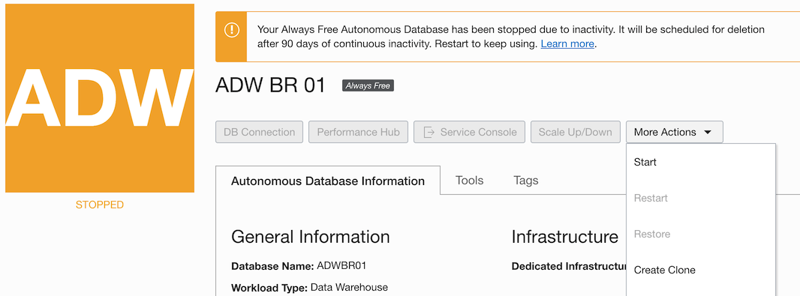
    <figcaption style="text-align:center;">Figure 11<figcaption>
</figure>

2. Confirm that you would like to start the database by clicking Start in the confirmation window.

3. You will see a status of “Starting”

<figure>
    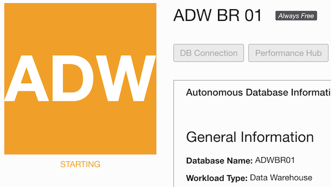
    <figcaption style="text-align:center;">Figure 12<figcaption>
</figure>

4. After a few moments the database status will change to “Available” and you are then free to continue use.

<figure>
    
    <figcaption style="text-align:center;">Figure 13<figcaption>
</figure>

## Downloaded wallet file and testing database:

1. Click on the DB Connection Button (Tab) and select **Download Wallet**.

<figure>
    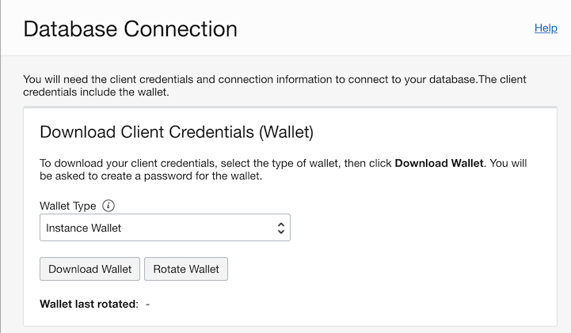
    <figcaption style="text-align:center;">Figure 14<figcaption>
</figure>

2. It will ask you to set a password and Download the file. Remember where you stored this wallet file you will need it later. 

*FYI it will call the file with your Instance name + wallet.zip* 

*Do not unzip this file as you will need it zipped to use*

<figure>
    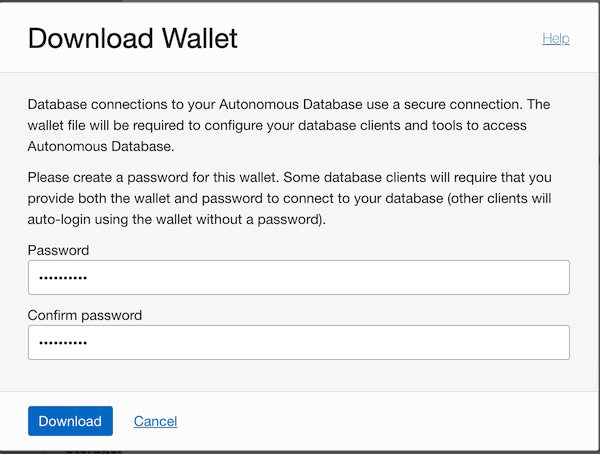
    <figcaption style="text-align:center;">Figure 15<figcaption>
</figure>

3. Close the **Database Connection** window and select the **Tools** tab and **Open SQL Developer Web**.

<figure>
    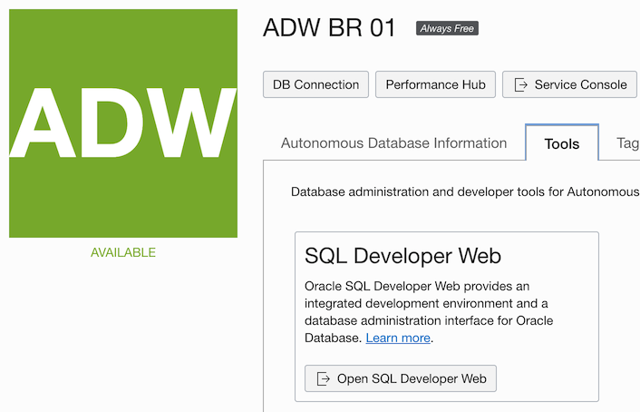
    <figcaption style="text-align:center;">Figure 16<figcaption>
</figure>

4. Enter the **Admin** credentials creating when intializing our Database.

<figure>
    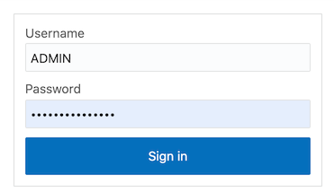
    <figcaption style="text-align:center;">Figure 17<figcaption>
</figure>

5. Click the blue buttons through the tool information tour.

<figure>
    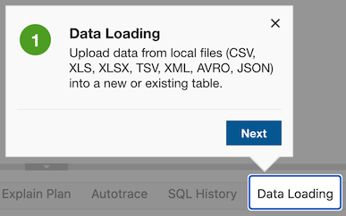
    <figcaption style="text-align:center;">Figure 17<figcaption>
</figure>

